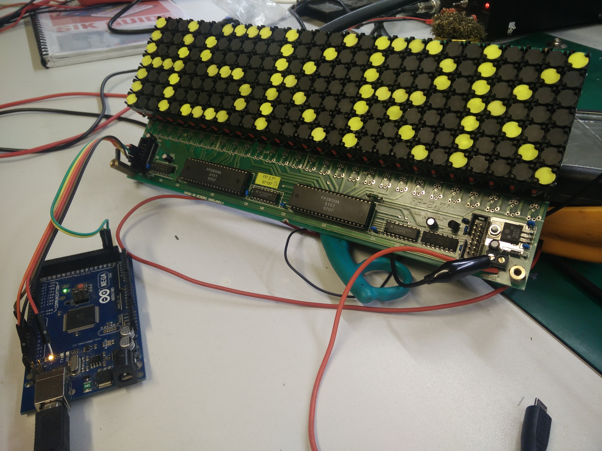

# Dot display driver

For this kind of display:

Hacked during one night (14.07.2018) in [Hackerspace Kraków](https://hackerspace-krk.pl/).

# Basics

Display uses two shift registers (74HC595) which control addressable coils drivers FP2800A.

This code uses SPI to shift data into registers and control ENABLE pin of drivers.

